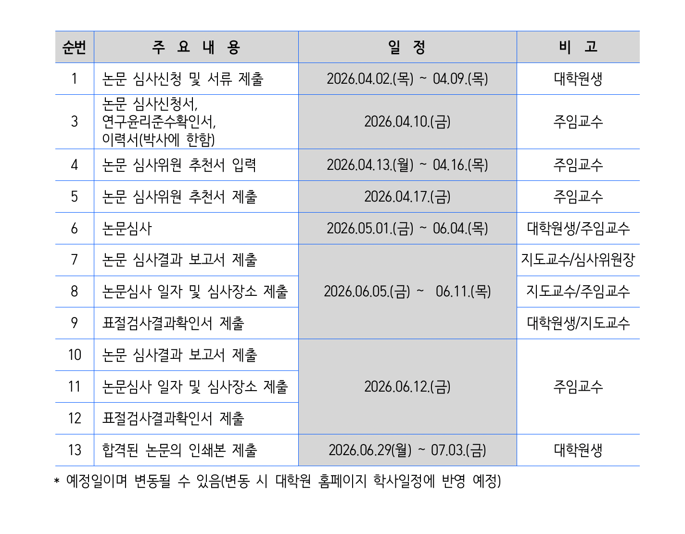
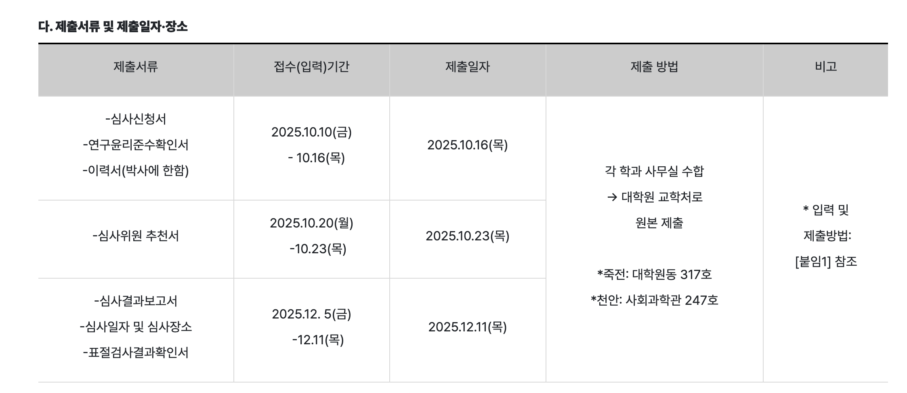
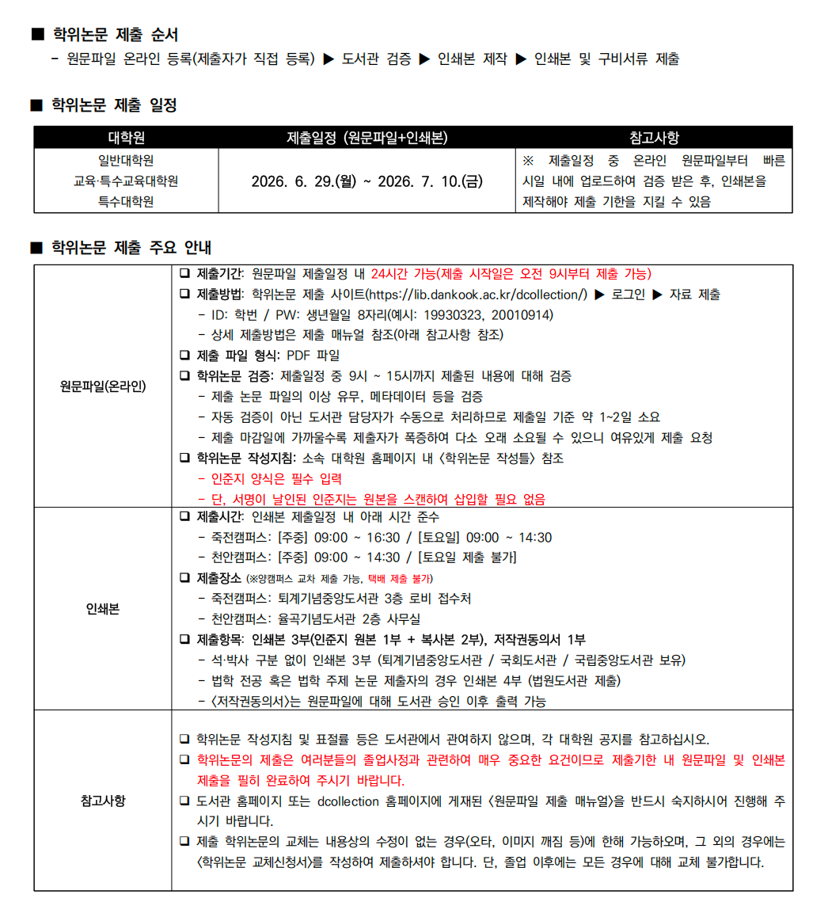
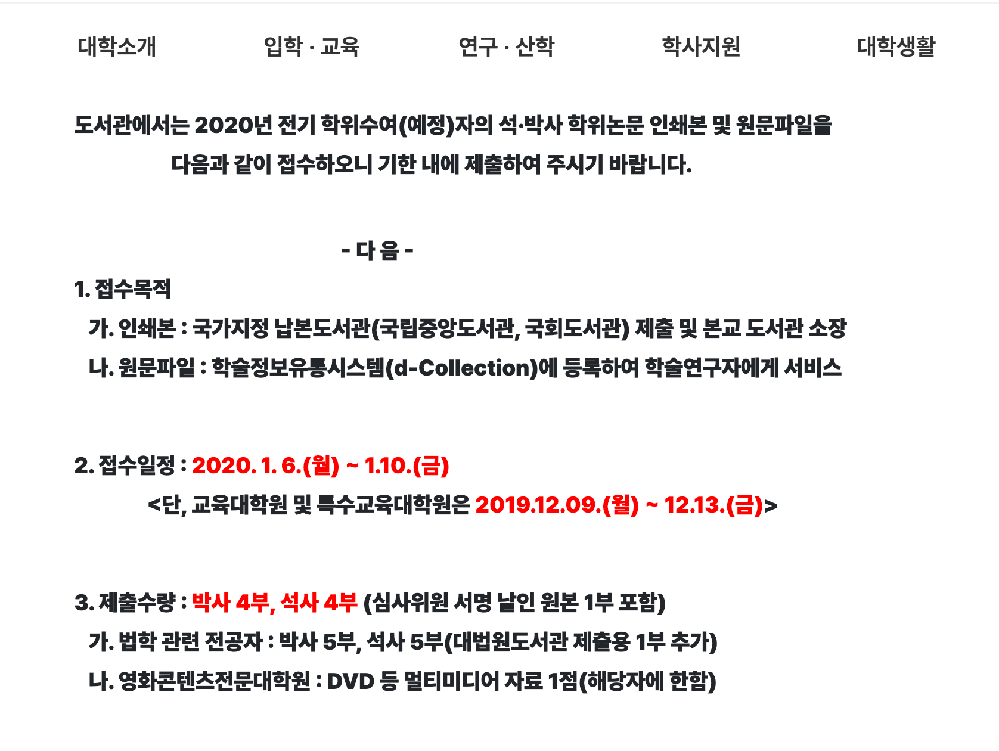

# 논문 작성, 학위논문 제출 및 투고 준비

이 페이지는 학위논문 제출 일정, 학위논문 작성 참고자료, 그리고 저널 논문 투고 시 주의해야 할 사항을 정리한 문서입니다.  
아래 내용은 실험실 후배들이 논문을 준비할 때 참고할 수 있도록 정리한 경험 기반 안내입니다.

---

## 1. 학위논문 제출 일정

학위논문 관련 일정은 매년 학교 공지에 따라 달라질 수 있으므로, 반드시 해당 연도의 대학원 공지를 확인해야 합니다.  
아래 일정은 참고용 예시입니다.

### 1.1 제1학기 일정

보통 제1학기에는 아래와 같은 순서로 진행됩니다.

| 기간 | 내용 |
|---|---|
| 4.2 ~ 4.9 | 학위논문 신청 및 관련 서류 제출 |
| 5.1 ~ 6.4 | 논문 심사 |
| 6.29 ~ 7.3 | 논문 인쇄본 제작 및 제출 |

---

### 1.2 제2학기 일정

보통 제2학기에는 아래와 같은 순서로 진행됩니다.

| 기간 | 내용 |
|---|---|
| 10.10 ~ 10.16 | 학위논문 신청 및 관련 서류 제출 |
| 11.1 ~ 12.4 | 논문 심사 |
| 1.6 ~ 1.10 | 논문 인쇄본 제작 및 제출 |

git push origin main
    위 일정은 예시이므로 매년 반드시 학교 공지사항을 다시 확인해야 합니다.  
    특히 신청 기간, 심사 기간, 도서관 제출 기간을 놓치면 졸업 일정에 문제가 생길 수 있습니다.

---

## 2. 학위논문 제작 및 도서관 제출

논문 심사가 끝난 후에는 바로 인쇄하는 것이 아니라, 먼저 도서관 시스템에 원문파일을 제출하고 검증을 받아야 합니다.  
도서관 검증이 완료된 후 인쇄본을 제작하는 것이 안전합니다.

### 2.1 논문 제작 관련 안내

!!! tip "경험상 중요한 점"
    마감일 직전에 제출하면 도서관 검증이 늦어질 수 있습니다.  
    가능하면 원문파일은 마감일보다 며칠 먼저 제출하고, 검증 완료 후 인쇄본을 제작하는 것이 좋습니다.

---

## 3. 실험실 참고자료

아래 자료는 학위논문 작성, 논문 형식 확인, 발표자료 준비 시 참고할 수 있습니다.

- [박사 학위논문 예시 다운로드](../assets/pdf/paper-search/thesis-example.pdf)
- [공학계열 학위논문 작성 양식 다운로드](../assets/pdf/paper-search/thesis-format-guide.docx)
- [박사 발표 PPT 예시 다운로드](../assets/pdf/paper-search/phd-presentation.pptx)

!!! note "파일명 관련"
    파일명은 가능하면 영어로 저장하는 것이 좋습니다.  
    한글 파일명도 사용할 수 있지만, GitHub Pages에서 링크 오류가 생길 수 있으므로 영어 파일명을 추천합니다.

---

## 4. 학위논문 작성 시 주의사항

석사논문과 박사논문은 구성과 분량에서 차이가 있습니다.

석사논문은 보통 하나의 연구 주제를 중심으로 작성합니다.  
박사논문은 하나의 큰 주제 아래 여러 개의 세부 연구를 포함하는 경우가 많습니다.

작성할 때는 아래 사항을 미리 확인하는 것이 좋습니다.

- 학교 학위논문 작성 지침 확인
- 표지, 인준지, 초록, 목차 양식 확인
- 그림 번호와 표 번호 확인
- 참고문헌 형식 통일
- PDF 변환 후 페이지 깨짐 확인
- 인준지 양식 확인
- 도서관 제출용 원문파일 확인
- 인쇄본 제출 부수 확인

!!! warning "주의"
    심사 후 제목이나 내용이 바뀐 경우, 학교 시스템과 도서관 제출 정보가 일치하는지 반드시 확인해야 합니다.

---

## 5. 저널 논문 투고 시 주의사항

저널 논문은 학위논문과 다르게, 투고하려는 저널의 형식과 요구사항에 맞추어 작성해야 합니다.

### 5.1 저널 선택

저널을 선택할 때는 아래 내용을 확인합니다.

- 연구 주제와 저널 scope가 맞는지 확인
- 최근 출판된 논문 주제 확인
- 논문 형식 및 분량 제한 확인
- Open Access 여부와 APC 확인
- 심사 기간 확인
- 그림, 표, Supplementary Information 요구사항 확인

---

### 5.2 그림 준비

이론관련논문 그림은 보통 9개 이내로 정리하는 경우가 많습니다.  
저널에 따라 다르지만, 너무 많은 그림을 본문에 넣기보다는 핵심 그림만 본문에 두고 나머지는 Supporting Information에 넣는 것이 좋습니다.

그림 준비 시 확인할 점은 아래와 같습니다.

- 해상도는 보통 300 dpi 이상 권장
- 가능하면 TIFF 형식으로 저장
- 그림 안의 글자 크기 통일
- 축 이름, 단위, 범례 확인
- 그림 번호와 본문 설명 일치 확인
- 캡션만 읽어도 그림의 의미를 이해할 수 있도록 작성

---

### 5.3 참고문헌 관리

참고문헌은 Mendeley, Zotero, EndNote 같은 프로그램을 사용하면 편합니다.

확인할 점은 아래와 같습니다.

- 저널 형식에 맞는 citation style 적용
- 저자명, 연도, 권호, 페이지 확인
- DOI 누락 여부 확인
- 본문 인용 순서와 참고문헌 목록 일치 확인

---

### 5.4 Cover Letter 작성

Cover letter는 너무 길게 쓰지 않는 것이 좋습니다.  
보통 아래 내용을 간단히 포함합니다.

- 논문 제목
- 투고 저널명
- 연구의 핵심 내용
- 이 논문이 왜 해당 저널에 적합한지
- 저자 정보
- 중복 투고가 아니라는 statement

!!! note "작성 팁"
    Cover letter는 논문을 다시 길게 요약하는 글이 아니라,  
    편집자에게 “이 논문이 왜 이 저널에 적합한지”를 짧고 명확하게 설명하는 글입니다.

---

### 5.5 TOC 또는 Graphical Abstract

일부 저널은 TOC figure 또는 Graphical Abstract를 요구합니다.

준비할 때는 아래를 확인합니다.

- 저널에서 요구하는 이미지 크기
- 글자가 너무 작지 않은지 확인
- 너무 복잡하지 않게 구성
- 논문의 핵심 메시지가 한눈에 보이도록 작성

---

## 6. 논문 투고 전 최종 체크리스트

투고 전 아래 내용을 마지막으로 확인합니다.

- [ ] 저널 scope 확인
- [ ] Author Guidelines 확인
- [ ] 제목, 저자명, 소속 확인
- [ ] 교신저자 정보 확인
- [ ] Abstract 길이 확인
- [ ] Keywords 확인
- [ ] Figure 번호 및 Caption 확인
- [ ] Table 번호 및 Caption 확인
- [ ] 참고문헌 형식 확인
- [ ] Supplementary Information 확인
- [ ] Cover Letter 작성
- [ ] TOC figure 또는 Graphical Abstract 필요 여부 확인
- [ ] 모든 파일명을 영어로 정리
- [ ] 최종 PDF 확인

---

