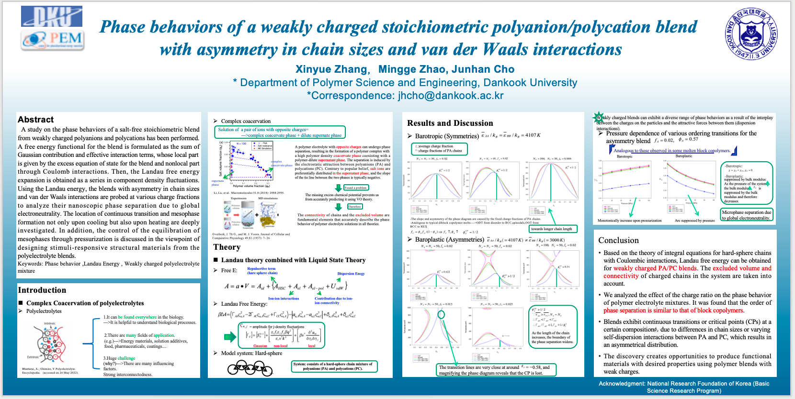
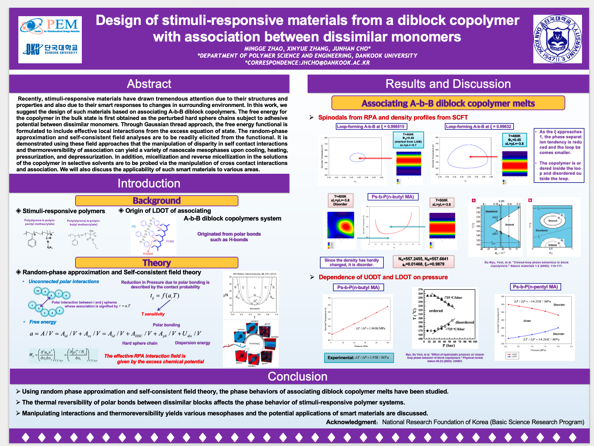
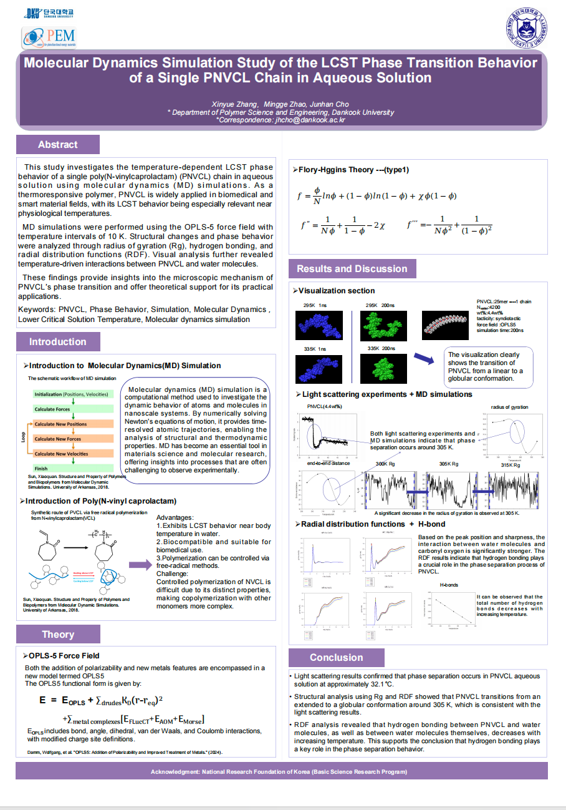
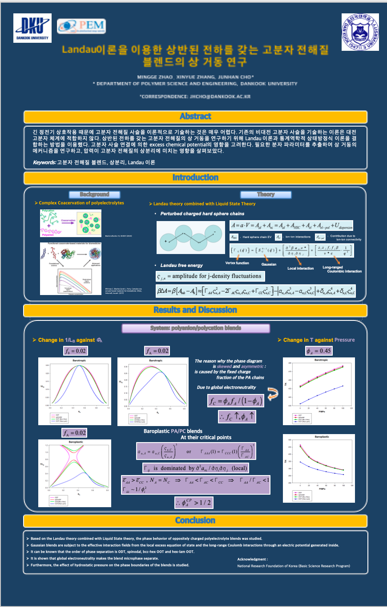

# 고분자학회 초록 등록 및 포스터 발표 준비

이 페이지는 고분자학회 초록 등록, 포스터 발표 준비, 학회 참석 시 주의사항을 정리한 문서입니다.

---

## 1. 학회 일정 확인

고분자학회는 보통 1년에 두 번 개최됩니다.

- 춘계 학회
- 추계 학회

!!! warning "주의"
    초록 제출 마감일, 사전등록 마감일, 포스터 발표 일정은 매년 다르므로 반드시 학회 홈페이지에서 확인해야 합니다.

---

## 2. 자주 참석하는 학회

| 구분 | 학회명 | 비고 |
|---|---|---|
| 국내 | 한국고분자학회 | 초록 등록 및 포스터 발표 |
| 해외 | APS March Meeting | 발표 분야 확인 필요 |
| 국내/전문 | 고분자물리 관련 학회 | 연구 주제에 따라 참석 |

---

## 3. 초록 등록 전 준비물

초록 등록 전에 아래 내용을 먼저 준비합니다.

- 논문/연구 제목
- 저자 정보
- 소속 정보
- 발표자 정보
- 초록 본문
- 발표 분야
- 발표 구분: 포스터 또는 구두발표
- 회원 가입 및 회비 납부 여부 확인

!!! note "회원비"
    학회 등록 전에 회원비 납부가 필요한 경우가 있으므로, 등록 전에 반드시 확인합니다.

---

## 4. 초록 등록 방법

### 4.1 발표 분야 선택

초록 등록 시 특별 발표분야는 보통 선택하지 않습니다.

| 항목 | 선택 내용 |
|---|---|
| 특별 발표분야 | 선택하지 않음 |
| 발표 분야 | 기조강연/일반발표/부문위원회 |
| 세부 분야 | 고분자구조 및 물성 |

---

### 4.2 발표 구분 선택

| 항목 | 선택 내용 |
|---|---|
| 발표 구분 | 포스터 발표 |
| 발표 장소 | 포스터 |

---

### 4.3 저자 정보 입력

저자 정보는 다음 순서로 입력합니다.

1. 발표자 입력
2. 공동저자 입력
3. 지도교수님 정보 확인
4. 소속 정보 확인
5. 이메일 확인

!!! warning "주의"
    저자 순서와 소속 정보는 제출 전 반드시 다시 확인합니다.

---

### 4.4 초록 입력

초록 입력 시 다음 내용을 확인합니다.

- 제목 오탈자 확인
- 저자명 확인
- 소속 확인
- 초록 본문 길이 확인
- 특수문자, 위첨자, 아래첨자 깨짐 확인

---

### 4.5 등록하기

모든 정보를 입력한 후 `등록하기` 버튼을 클릭합니다.

등록 완료 후에는 다음 사항을 확인합니다.

- 접수번호
- 발표 분야
- 발표 구분
- 발표자 정보
- 초록 PDF 또는 확인 페이지 저장

!!! tip "추천"
    등록 완료 화면은 캡처하거나 PDF로 저장해 둡니다.

---

## 5. 포스터 제작 및 출력

포스터는 학회에서 지정한 크기와 형식에 맞추어 제작합니다.

| 항목 | 내용 |
|---|---|
| 출력 재질 | 천 포스터 추천 |
| 준비물 | 포스터, 압정, 테이프 |
| 확인 사항 | 제목, 저자, 소속, 그림 해상도 |

!!! note "포스터 재질"
    학회 참석 시 이동과 보관이 편리하도록 천 포스터로 출력하는 것이 좋습니다.

---

## 6. 학회 참석 시 준비물

학회 참석 전에 아래 물품을 준비합니다.

- 포스터
- 압정 또는 핀
- 테이프
- 명찰
- 노트북 또는 태블릿
- 발표 자료 백업 파일
- 교통편 및 숙소 정보

!!! warning "포스터 부착"
    포스터를 고정하기 위해 압정이나 테이프가 필요한 경우가 있으므로 미리 준비합니다.

---

## 7. 사진 예시

아래에는 초록 등록 화면, 발표 분야 선택 화면, 포스터 예시 등을 추가합니다.

### 7.1 APS 예시

### 7.2 고분자학회 예시

## 8. 발표자료 예시 파일

아래 파일은 초록 등록 또는 포스터/발표자료 작성 시 참고할 수 있는 예시입니다.

- [APS1 발표자료 다운로드](../assets/pdf/polymer-society/APS1.pptx)
- [APS2 발표자료 다운로드](../assets/pdf/polymer-society/APS2.pptx)
- [고분자학회1 발표자료 다운로드](../assets/pdf/polymer-society/polymer1.pptx)
- [고분자학회2 발표자료 다운로드](../assets/pdf/polymer-society/polymer2.pptx)
- [고분자학회3 발표자료 다운로드](../assets/pdf/polymer-society/polymer3.pptx)