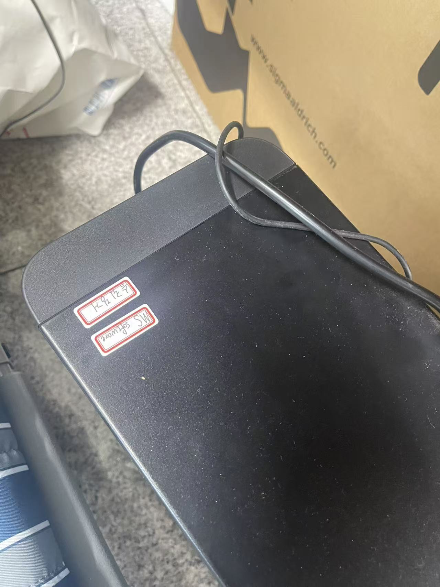
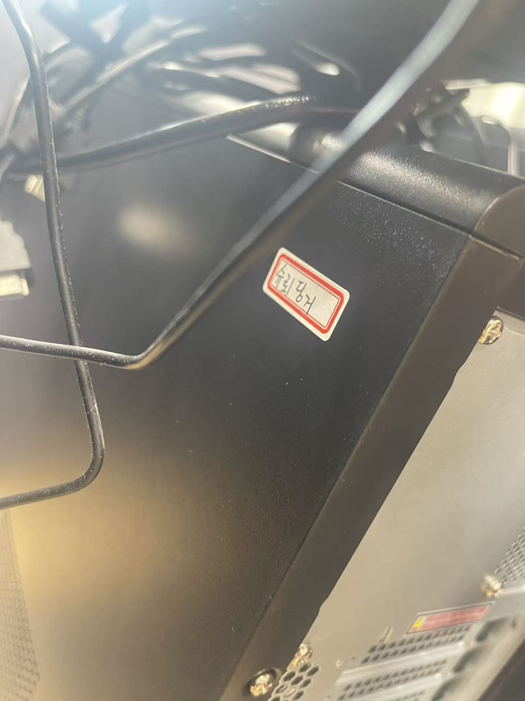
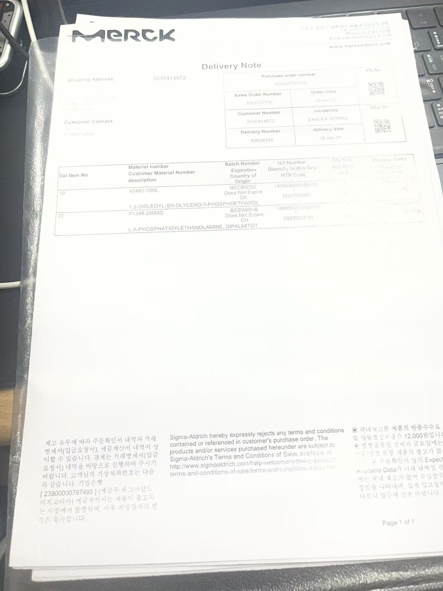
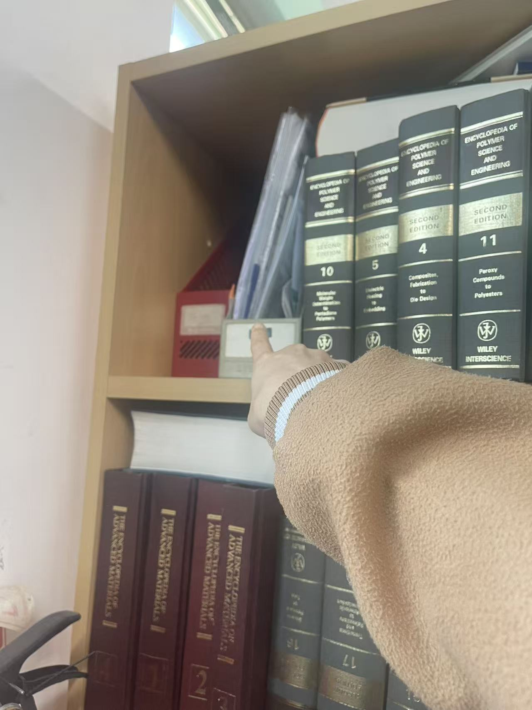
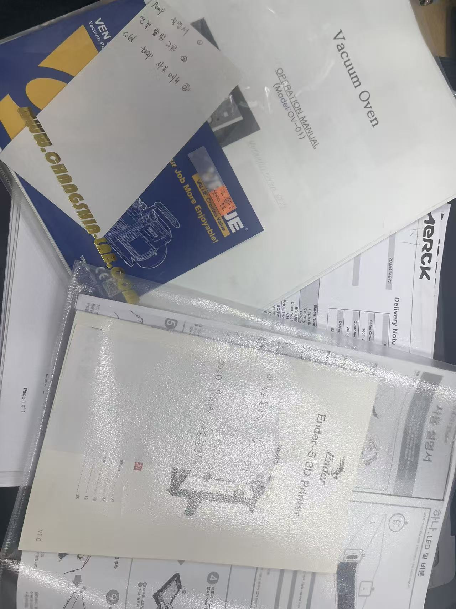
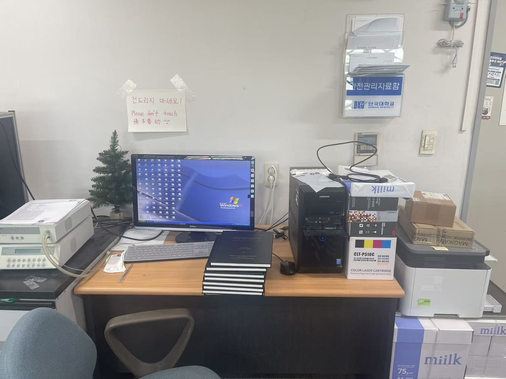
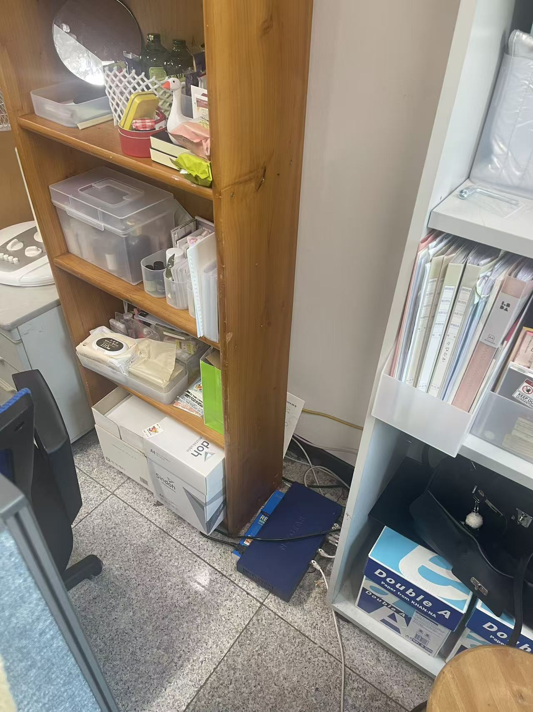
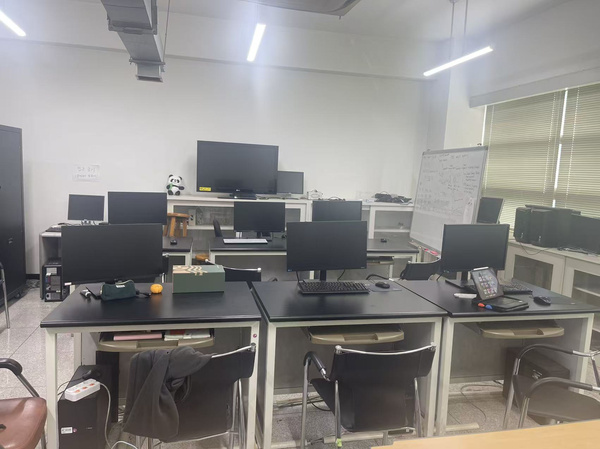

# 실험실 기본 운영 및 공용 장비 안내

이 페이지는 실험실 공간 구성, 공용 컴퓨터 사용, 광산란 장비용 컴퓨터, 슈퍼컴퓨터 전원, 시약 관리표 및 관련 자료 보관 방법을 정리한 문서입니다.  
새로 실험실에 들어오는 학생들은 실험실을 사용하기 전에 아래 내용을 먼저 확인하시기 바랍니다.

---

## 1. 실험실 공간 안내

우리 실험실에서 주로 사용하는 공간은 다음과 같습니다.

| 공간 | 설명 |
|---|---|
| 420호 | 연구실 / 사무 공간 |
| 424-1호 | 실험 및 설계 관련 실험실 |

420호는 주로 학생들이 사용하는 사무 공간이며, 424-1호는 실험 및 장비 사용과 관련된 공간입니다.

---

## 2. 420호 공용 컴퓨터

420호에는 Schrödinger 소프트웨어가 설치된 공용 컴퓨터가 있습니다.  
그중 한 대에는 Materials Studio 소프트웨어도 설치되어 있으며, 해당 컴퓨터에는 `MS software` 표시가 붙어 있습니다.

공용 컴퓨터 비밀번호는 아래와 같습니다.

```text
Dankook!
```

아래 이미지는 420호 공용 컴퓨터와 Materials Studio 표시를 확인하기 위한 참고 자료입니다.





!!! warning "주의"
    중요한 계산 파일이나 데이터는 개인 폴더 또는 서버에 따로 백업하는 것이 좋습니다.


---

## 3. 실험실 시약 관리표

실험실에서 사용하는 시약은 관리표에 정리해야 합니다.  
새로운 시약이 들어오거나 기존 시약 정보가 변경되는 경우, 반드시 시약 관리표를 업데이트해야 합니다.

### 3.1 시약 정보 작성 시 확인할 내용

시약 관리표에는 가능한 한 아래 정보를 기록합니다.

- 시약명
- 보관 위치
- 사용자 또는 담당자
- 구입일 또는 등록일
- 보관 조건
- 위험성 여부
- 폐기 필요 여부
- 비고 사항

새로운 약품이 들어온 경우, 시약 관리표에 정보를 추가하고 관련 영수증 또는 증빙자료를 함께 보관합니다.

---

## 4. 시약 관련 증빙자료 및 보관 위치

새로운 약품을 구입하거나 시약 정보가 업데이트된 경우, 관련 자료를 함께 저장해야 합니다.

확인할 내용은 아래와 같습니다.

- 새 약품 정보 업데이트
- 구입 영수증 또는 관련 증빙자료 보관
- 시약 보관 위치 확인
- 관리표와 실제 보관 위치 일치 여부 확인

아래 이미지는 시약 정보 저장 및 보관 위치 확인을 위한 참고 자료입니다.





---

## 5. 시약 관리표 파일

실험실 시약 관리표는 아래 파일을 참고합니다.

[실험실 시약 관리표 다운로드](../assets/excel/experiment/lab_polymer.xlsx)


---

## 6. 장비 모델명 및 관련 설명 자료

실험실 장비를 사용할 때에는 장비 모델명, 사용 방법, 관련 설명 자료를 확인해야 합니다.  
장비 관련 서류나 모델명 정보는 후배들이 장비를 사용할 때 참고할 수 있도록 정리해 두는 것이 좋습니다.



---

## 7. 광산란 장비용 컴퓨터

420호에는 광산란 장비와 연결된 전용 컴퓨터가 있습니다.  
이 컴퓨터는 광산란 장비 제어 및 데이터 측정을 위한 컴퓨터이므로 임의로 사용하거나 설정을 변경하면 안 됩니다.



### 7.1 사용 시 주의사항

- 이 컴퓨터는 절대 함부로 조작하지 않습니다.
- 인터넷에 연결하지 않습니다.
- 운영체제는 Windows XP입니다.
- 보안 문제 및 외부 공격 위험이 있으므로 네트워크 연결을 피해야 합니다.
- 장비 측정 목적 외에는 사용하지 않습니다.
- 프로그램이나 시스템 설정을 임의로 변경하지 않습니다.

만약 컴퓨터가 멈추거나 작동이 원활하지 않은 경우, 상황을 확인한 뒤 전원을 껐다가 다시 켤 수 있습니다.  
다만 이 컴퓨터는 실험실에서 자체적으로 Windows XP 시스템을 설치하여 사용하는 장비이므로, 재부팅 후 시스템 오류가 발생할 수 있습니다.

!!! danger "중요"
    광산란 장비용 컴퓨터는 장비와 연결된 전용 컴퓨터입니다.  
    문제가 생기면 임의로 여러 번 조작하지 말고, 먼저 실험실 담당자 또는 경험이 있는 선배에게 문의합니다.

---

## 8. 슈퍼컴퓨터 전원 관련 주의사항

실험실에 있는 파란색 박스는 슈퍼컴퓨터와 관련된 전원 장치입니다.  
누구든지 임의로 만지면 안 됩니다.



!!! danger "절대 주의"
    파란색 전원 박스는 슈퍼컴퓨터 전원과 관련된 장치이므로 절대 임의로 조작하거나 전원을 끄면 안 됩니다.  
    문제가 있어 보이는 경우 반드시 담당자에게 먼저 알립니다.

---

## 9. 424-1호 실험실 컴퓨터

424-1호 실험실에는 Materials Studio 소프트웨어가 설치된 컴퓨터가 있습니다.  
현재 총 6대의 컴퓨터에 Materials Studio가 설치되어 있습니다.




### 9.1 시스템 업데이트 또는 재설정이 필요한 경우

컴퓨터 시스템 업데이트나 Materials Studio 재설정이 필요한 경우, 회사에 이메일로 문의하여 원격 설정을 요청해야 합니다.

!!! warning "주의"
    소프트웨어 라이선스, 시스템 설정, 원격 접속 설정은 임의로 변경하지 않습니다.  
    문제가 발생하면 먼저 실험실 책임자 또는 담당자에게 알리고, 필요한 경우 회사에 원격 설정을 요청합니다.

---

## 10. 실험실 기본 사용 시 주의사항

실험실을 사용할 때에는 아래 사항을 항상 확인합니다.

- 공용 컴퓨터 사용 후 개인 파일 정리
- 시약 사용 후 원래 위치에 보관
- 새 시약 또는 변경된 시약 정보는 관리표에 기록
- 관련 영수증 또는 증빙자료 보관
- 실험실 공간 정리
- 장비 및 컴퓨터 상태 이상 여부 확인
- 광산란 장비용 컴퓨터는 임의로 조작하지 않기
- 슈퍼컴퓨터 전원 장치는 절대 임의로 만지지 않기
- 문제가 발생하면 담당자에게 공유

---

