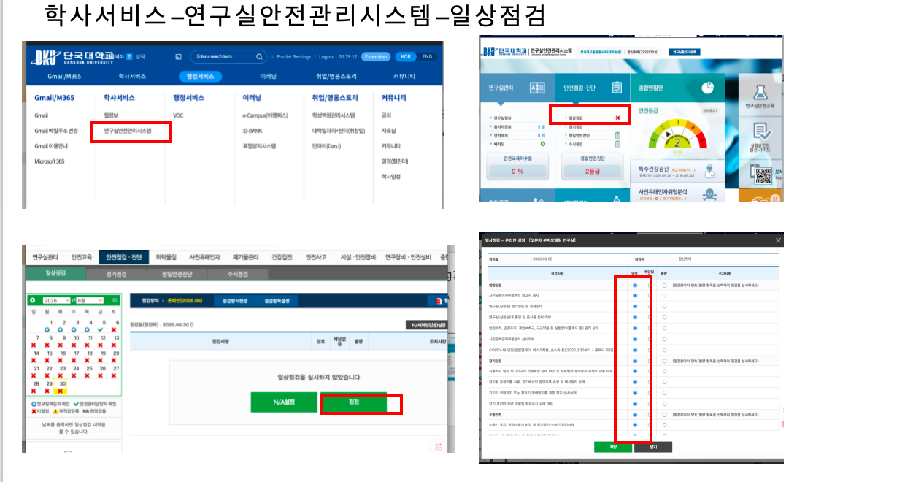

# 실험실 안전관리 및 안전점검 안내

이 페이지는 실험실 안전관리, 매월 안전점검, 안전교육 이수, 관련 서류 제출 및 개선조치 방법을 정리한 문서입니다.  
실험실 안전관리는 매월 또는 매 학기마다 반복적으로 확인해야 하므로, 아래 내용을 참고하여 누락되는 항목이 없도록 관리합니다.

---

## 1. 실험실 안전관리 기본사항

실험실 관리 시 기본적으로 아래 사항을 주기적으로 확인해야 합니다.

| 구분 | 내용 | 시기 |
|---|---|---|
| 일상점검 | 실험실 안전점검 실시 | 매월 |
| 안전교육 | 연구실 안전교육 이수 | 매 학기 3월, 9월 |
| 이수증명서 제출 | 안전교육 이수 후 이수증명서 저장 및 제출 | 교육 이수 후 |
| 안전관리 자료 제출 | 점검표, 연구개발활동표, 유해인자 관련 자료 등 제출 및 보관 | 필요 시 / 정기적으로 |
| 개선조치 | 지적사항 수정 후 개선 사진 업로드 및 조치 내용 작성 | 점검 후 |

!!! warning "주의"
    연구실 안전교육은 매 학기 3월과 9월에 반드시 이수해야 하며, 이수 후에는 이수증명서를 저장하고 필요 시 제출해야 합니다.

---

## 2. 안전점검 위치

실험실 안전점검은 학교 안전관리시스템에서 진행합니다.

접속 위치는 아래와 같습니다.

**학사서비스 → 연구실안전관리시스템 → 일상점검**

아래 이미지는 연구실안전관리시스템의 일상점검 위치를 확인하기 위한 참고 자료입니다.

---

## 3. 실험실 안전관리에서 자주 발생하는 문제 및 대응방법

아래 항목들은 실험실 안전점검에서 자주 확인되거나 지적될 수 있는 문제입니다.  
정기점검 전후로 반드시 확인하는 것이 좋습니다.

---

### 3.1 전기배선 정리 문제

두 실험실 모두 바닥에 전선이 방치되어 있으면 안 됩니다.  
바닥이나 통로에 전선이 있으면 넘어짐, 감전, 장비 손상 등의 위험이 있습니다.

**자주 발생하는 문제**

- 실험실 바닥에 전선이 길게 노출되어 있음
- 통로에 멀티탭이나 전원선이 놓여 있음
- 장비 뒤쪽 전선이 엉켜 있음
- 사용하지 않는 전선이 정리되지 않음

**대응방법**

- 바닥에 있는 전선은 벽면이나 책상 아래쪽으로 정리합니다.
- 통로를 지나가는 전선은 없도록 정리합니다.
- 멀티탭은 바닥에 방치하지 않고 안전한 위치에 고정합니다.
- 손상된 전선이나 오래된 멀티탭은 교체합니다.
- 장비 사용 후 전원선 상태를 확인합니다.

---

### 3.2 안전관리 자료함 정리

실험실 입구 쪽 안전관리 자료함에는 필요한 안전 관련 자료를 정리해서 보관해야 합니다.

**자료함에 넣어야 하는 자료 예시**

- 실험실 안전점검표
- 연구개발활동표
- 연구실 안전교육 관련 자료
- 이수증명서 관련 자료
- 비상연락망
- 안전관리 안내문
- 기타 학교에서 요구하는 안전 관련 서류

**자주 발생하는 문제**

- 자료함 안에 필요한 서류가 없음
- 오래된 자료가 그대로 보관되어 있음
- 점검표나 연구개발활동표가 최신 상태가 아님
- 필요한 자료가 흩어져 있어서 점검 시 바로 찾기 어려움

**대응방법**

- 안전관리 자료함에 필요한 서류를 정리해서 넣어둡니다.
- 오래된 자료는 정리하고 최신 자료로 교체합니다.
- 점검표, 연구개발활동표, 교육 관련 자료는 한곳에 모아둡니다.
- 정기점검 전 자료함을 다시 확인합니다.

---

### 3.3 위험약품 및 주의약품 표시

위험성이 있거나 주의가 필요한 약품은 시약장 또는 시약 선반 근처에 주의 표시를 부착해야 합니다.

**자주 발생하는 문제**

- 위험약품 주변에 주의 라벨이 없음
- 시약병 라벨이 오래되어 잘 보이지 않음
- 약품명, 사용자, 제조일, 위험성 정보가 누락됨
- 유해성이 있는 약품인데 별도 표시 없이 보관됨

**대응방법**

- 위험약품 또는 주의약품 주변에 주의 라벨을 부착합니다.
- 시약병에는 약품명, 사용자, 제조일, 보관 조건, 위험성 등을 표시합니다.
- 라벨이 훼손되었거나 정보가 부족한 경우 다시 작성합니다.
- 위험성이 큰 약품은 따로 구분하여 보관합니다.
- 필요한 경우 GHS 경고표지를 함께 부착합니다.

---

### 3.4 폐기 대상 약품 정리

오래 사용하지 않거나 폐기해야 하는 약품은 정기적으로 확인하고 정리해야 합니다.

**자주 발생하는 문제**

- 장기간 사용하지 않은 약품이 그대로 보관되어 있음
- 내용물이 불분명한 시료가 있음
- 오래된 시약병이나 변질 가능성이 있는 약품이 있음
- 폐기 대상 약품이 일반 시약과 함께 보관됨

**대응방법**

- 오래 사용하지 않은 약품을 정기적으로 확인합니다.
- 폐기 대상 약품은 따로 분류합니다.
- 내용물이 불분명한 시료는 임의로 사용하지 않습니다.
- 변색, 침전, 냄새 변화, 용기 파손 등이 있는 경우 담당자에게 알립니다.
- 폐기 전까지는 지정된 위치에 분리 보관합니다.
- 학교의 화학폐기물 처리 절차에 따라 반출 또는 폐기합니다.

!!! warning "주의"
    화학약품은 임의로 싱크대에 버리면 안 됩니다. 반드시 학교의 폐기물 처리 절차를 따라야 합니다.

---

### 3.5 연구개발활동표 작성

연구개발활동표는 정기적으로 작성해야 하며, 필요한 경우 지도교수님의 확인이 필요합니다.

**자주 발생하는 문제**

- 연구기간이 만료되었는데 수정하지 않음
- 참여 연구활동종사자가 최신 상태로 등록되어 있지 않음
- 현재 실험실에서 사용하는 장비나 시약이 반영되어 있지 않음
- 연구내용이 실제 연구활동과 맞지 않음
- 교수님 확인이 필요한데 확인 절차가 완료되지 않음

**대응방법**

- 연구기간을 정기적으로 확인합니다.
- 참여 연구활동종사자 명단을 최신 상태로 유지합니다.
- 연구내용, 사용 장비, 사용 시약, 유해인자 정보를 현재 상황에 맞게 수정합니다.
- 작성 후 지도교수님 또는 연구실 책임자 확인이 필요한 경우 확인을 요청합니다.

---

### 3.6 유해인자 및 약품표 작성

실험실에서 사용하는 유해인자와 약품 관련 표는 정확히 작성해야 합니다.

**자주 발생하는 문제**

- 실제 사용하는 약품이 표에 누락되어 있음
- 더 이상 사용하지 않는 약품이 그대로 남아 있음
- 보호구, 보관 방법, 주의사항이 충분히 작성되어 있지 않음
- 장비 사용과 관련된 위험요인이 반영되어 있지 않음

**대응방법**

- 현재 실험실에서 사용하는 약품과 장비를 기준으로 유해인자 정보를 작성합니다.
- 사용하지 않는 약품은 목록에서 정리하거나 폐기 여부를 확인합니다.
- 보호구, 보관 방법, 주의사항을 함께 작성합니다.
- 약품이나 장비가 변경되면 표도 함께 수정합니다.

---

### 3.7 실험실 음식물 정리

실험실 내 음식물 보관 및 섭취는 가능한 한 피해야 합니다.  
시약, 시료, 장비가 있는 공간에 음식물이 있으면 오염 및 안전사고 위험이 있습니다.

**자주 발생하는 문제**

- 실험대 위에 음식물이 놓여 있음
- 시약장 또는 장비 주변에 음료나 간식이 있음
- 오래된 음식물이 방치되어 있음
- 공용 공간이 정리되지 않음

**대응방법**

- 실험실 내 음식물은 즉시 정리합니다.
- 오래된 음식물은 폐기합니다.
- 시약장, 장비 주변, 실험대 위에는 음식물을 두지 않습니다.
- 실험 공간과 음식물 보관 공간을 분리합니다.

---

## 4. 개선조치 방법

안전점검 후 지적사항이 있는 경우, 문제를 수정한 뒤 안전관리시스템에 개선조치 내용을 입력하고 개선 사진을 업로드해야 합니다.

개선조치 순서는 아래와 같습니다.

1. 안전점검 결과에서 지적사항 확인
2. 해당 문제 수정
3. 개선 후 사진 촬영
4. 연구실안전관리시스템 접속
5. 개선 사진 업로드
6. 개선조치 내용 작성
7. 저장
8. 필요한 경우 연구실 책임자 또는 지도교수님 확인

**개선조치 작성 예시**

> 지적된 사항을 확인한 후 해당 내용을 정리 및 보완하였습니다. 개선 후 사진을 첨부하였으며, 향후 동일한 문제가 발생하지 않도록 정기적으로 확인하겠습니다.

**전기배선 정리 개선조치 예시**

> 실험실 바닥 및 장비 주변에 노출되어 있던 전선을 정리하였습니다. 통행 및 장비 사용에 방해가 되지 않도록 정리하였으며, 향후 정기적으로 확인하겠습니다.

**위험약품 라벨 보완 개선조치 예시**

> 주의가 필요한 약품 주변에 안전표지를 부착하였으며, 시약 라벨과 보관 상태를 확인하였습니다. 향후 위험약품은 별도로 관리하고 정기적으로 점검하겠습니다.

**폐기 대상 약품 정리 개선조치 예시**

> 장기간 사용하지 않은 약품을 확인하여 폐기 대상 물질을 분류하였습니다. 학교 화학폐기물 처리 절차에 따라 반출 또는 폐기할 예정이며, 처리 전까지는 지정된 위치에 분리 보관하겠습니다.

**안전관리 자료함 정리 개선조치 예시**

> 실험실 입구 안전관리 자료함에 필요한 점검표 및 관련 서류를 정리하여 보관하였습니다. 향후 점검 시 필요한 자료를 바로 확인할 수 있도록 정기적으로 관리하겠습니다.

---

## 5. 안전점검 체크리스트

정기점검 전 아래 항목을 확인합니다.

- [ ] 매월 일상점검 실시
- [ ] 매 학기 3월, 9월 안전교육 이수
- [ ] 이수증명서 저장 및 제출
- [ ] 안전관리 자료함 정리
- [ ] 실험실 전기배선 정리
- [ ] 위험약품 주의 라벨 부착
- [ ] 폐기 대상 약품 정리
- [ ] 연구개발활동표 작성
- [ ] 지도교수님 또는 책임자 확인 필요 여부 확인
- [ ] 유해인자 및 약품표 작성
- [ ] 실험실 음식물 정리
- [ ] 개선조치 사진 업로드
- [ ] 개선조치 내용 작성 및 저장

---