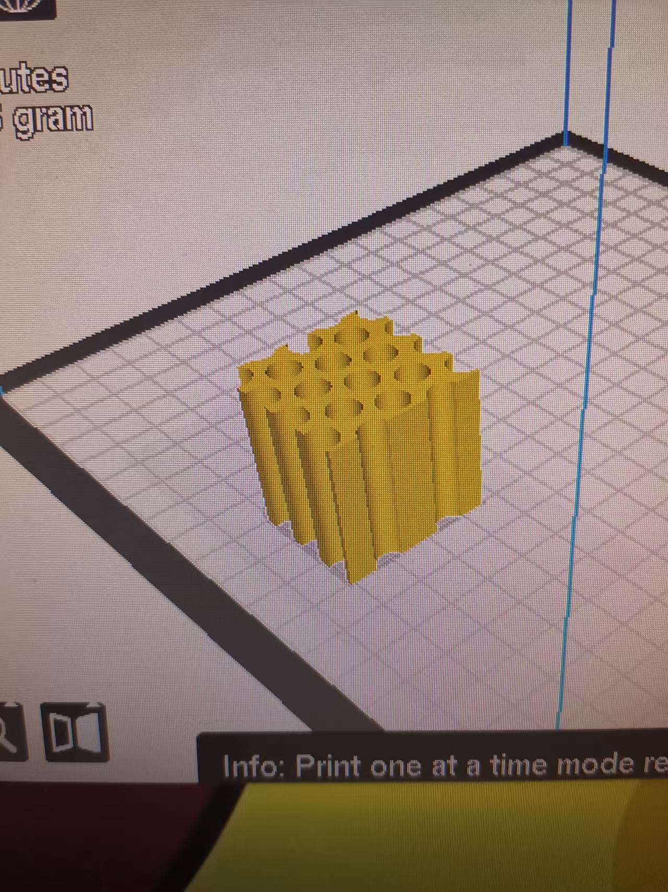
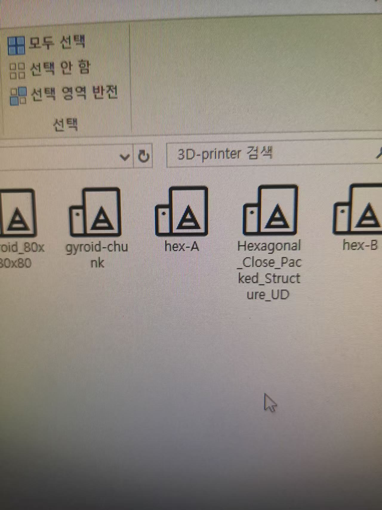
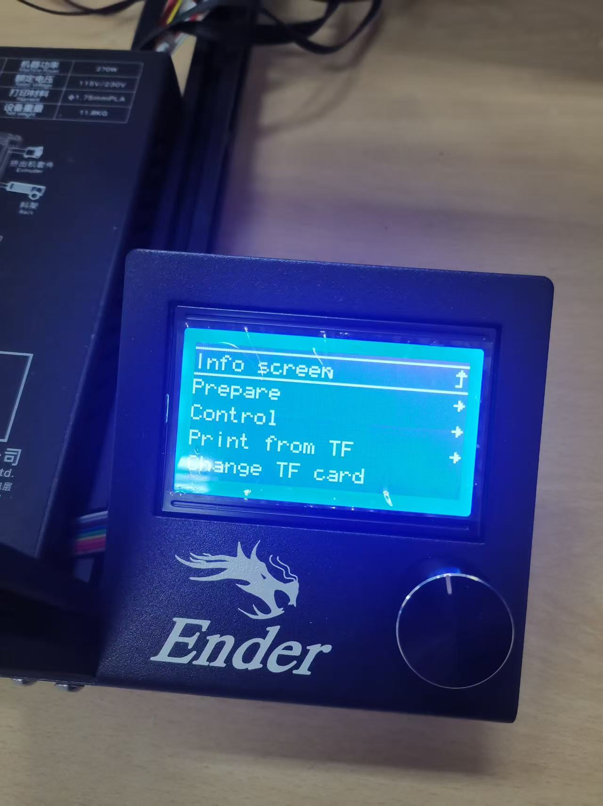
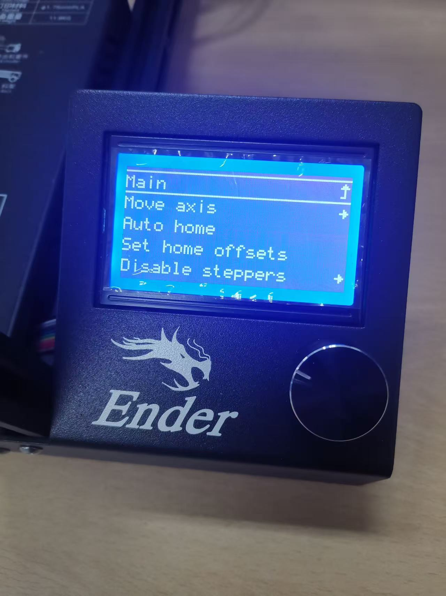
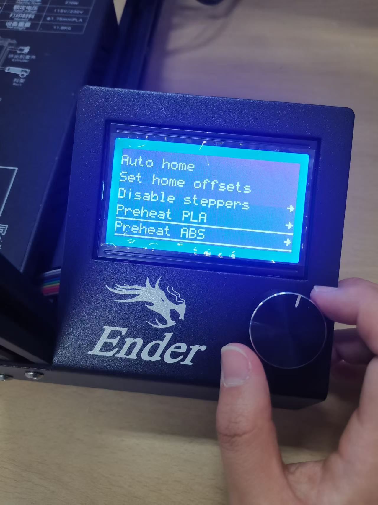
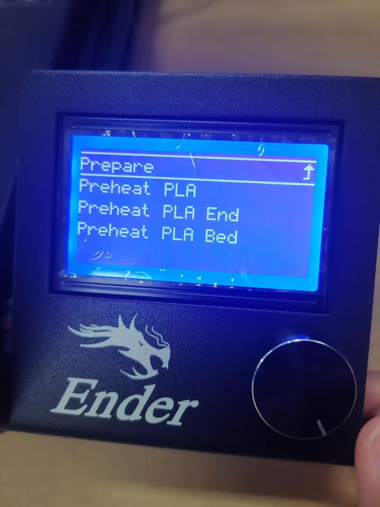
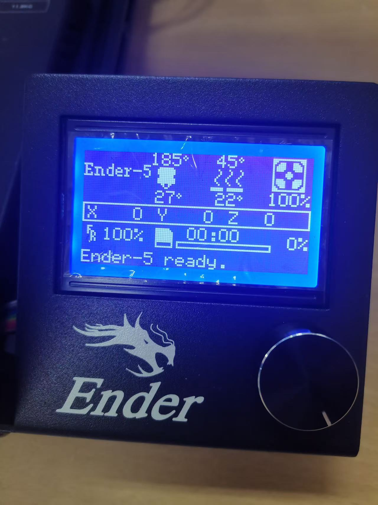
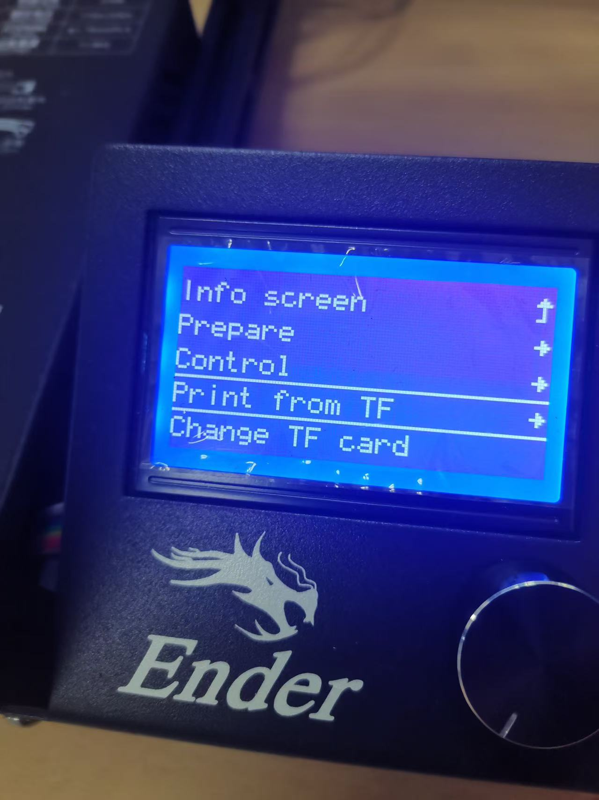
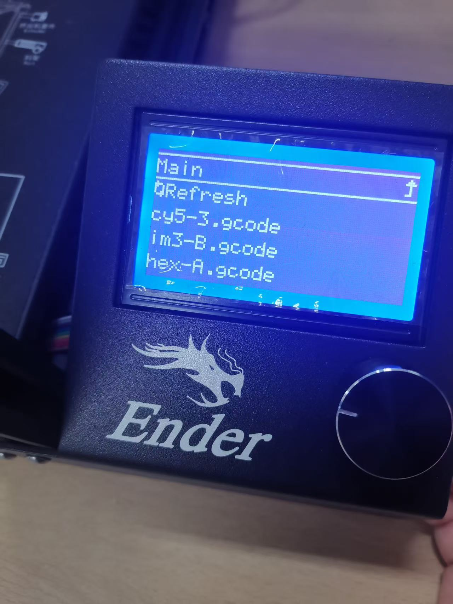
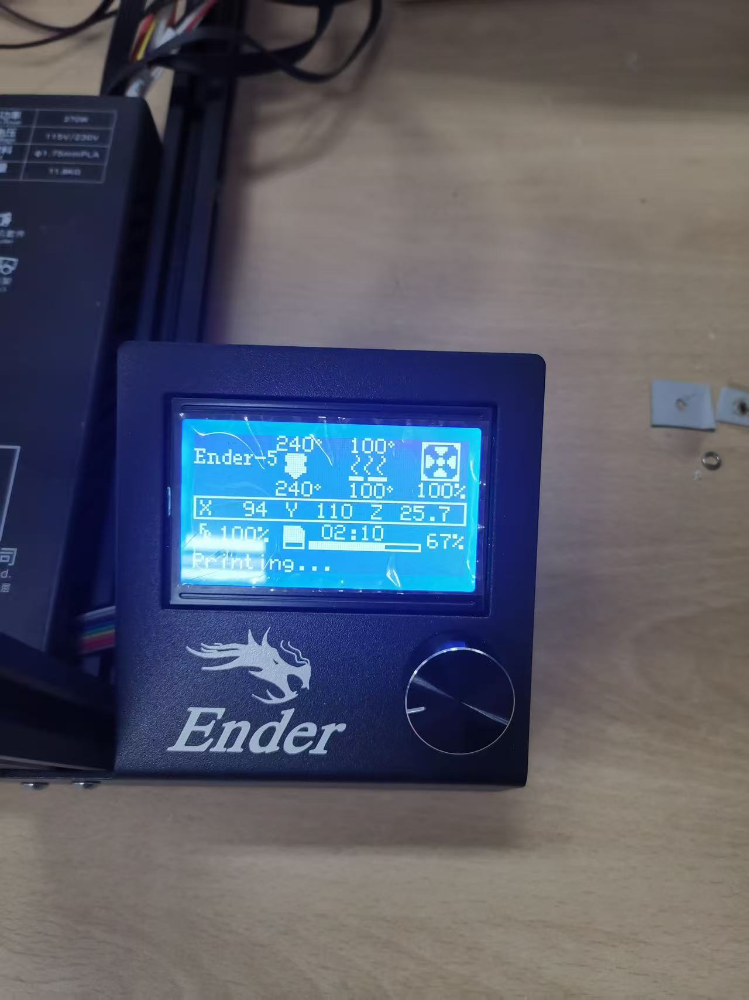

# 3D 프린터 사용 안내

이 페이지는 실험실 3D 프린터 사용 방법, 3D 구조 제작 방법, 파일 변환 방법 및 출력 시 주의사항을 정리한 문서입니다.  
실험실 3D 프린터는 주로 PLA 필라멘트를 사용합니다.

---

## 1. 3D 프린터 재료

현재 실험실 3D 프린터에서 사용하는 주요 재료는 다음과 같습니다.

| 항목 | 내용 |
|---|---|
| 사용 재료 | PLA |
| 사용 목적 | 간단한 구조물, 샘플 지지대, 실험 보조 구조물 제작 |
| 출력 파일 형식 | `.gcode` |

---

## 2. 3D 프린터용 구조 제작 방법

3D 프린터로 출력할 구조를 만드는 방법은 크게 두 가지가 있습니다.

### 2.1 3D 프린터 프로그램으로 직접 구조 제작

첫 번째 방법은 3D 프린터용 모델링 프로그램에서 원하는 구조를 직접 그리는 방법입니다.  
간단한 구조물은 프로그램에서 직접 제작한 후 출력 파일로 변환할 수 있습니다.

---

### 2.2 구조 파일을 변환하여 출력

두 번째 방법은 기존에 가지고 있는 구조 파일을 3D 프린터에서 사용할 수 있는 출력 파일로 변환하는 방법입니다.  
보통 `.gcode` 파일로 변환한 뒤 3D 프린터에서 출력합니다.

---

## 3. 3D 프린터 사용 방법

3D 프린터 사용 순서는 아래와 같습니다.

### 3.1 모델 제작

먼저 3D 프린터 프로그램을 이용하여 필요한 모델을 제작합니다.

---

### 3.2 출력 파일 저장

제작한 모델을 3D 프린터에서 사용할 수 있는 파일 형식으로 저장합니다.

- 파일 형식: `.gcode`
- 저장 위치: 3D 프린터용 저장 카드 또는 USB

실험실에는 3D 프린터용 저장 장치가 있으며, 이전에 만들어 둔 구조 파일도 저장되어 있을 수 있습니다.  
필요한 경우 기존 파일을 참고하거나 바로 사용할 수 있습니다.

---

### 3.3 저장 장치 삽입 및 파일 선택

출력 파일이 저장된 저장 장치를 3D 프린터에 삽입합니다.  
이후 프린터 화면에서 저장 장치 안의 파일을 선택합니다.

---

### 3.4 출력 시작

파일을 선택한 후 출력 조건을 확인하고 프린트를 시작합니다.  
아래 사진의 순서와 실제 화면에 나타나는 선택지를 참고하여 진행합니다.

!!! warning "주의"
    화면에 나타나는 옵션 순서는 상황에 따라 조금 다를 수 있습니다.  
    사진의 순서를 참고하되, 실제 프린터 화면에 표시되는 내용을 확인하면서 진행합니다.

---

## 4. SCT 구조를 3D 프린터 구조로 변환하는 방법

SCT 코드로 얻은 구조를 실험실 방식에 따라 3D 프린터용 구조로 변환할 수 있습니다.  
변환 후 해당 구조에 맞는 3D 프린터용 코드 파일을 생성하고 출력하면 됩니다.

관련 방법은 아래 논문을 참고할 수 있습니다.

> Scalfani, V. F., Turner, C. H., Rupar, P. A., Jenkins, A. H., & Bara, J. E. (2015).  
> 3D Printed Block Copolymer Nanostructures.  
> *Journal of Chemical Education*, 92(11), 1866–1870.  
> https://doi.org/10.1021/acs.jchemed.5b00375

!!! note "참고"
    SCT 구조를 3D 프린터용 구조로 변환하는 과정은 일반적인 프린터 사용보다 복잡할 수 있습니다.  
    처음 시도하는 경우 기존 예제 파일이나 선배가 사용한 코드를 먼저 확인하는 것이 좋습니다.

---

## 5. 출력 전 체크리스트

출력 전 아래 항목을 확인합니다.

- [ ] PLA 필라멘트가 충분한지 확인
- [ ] 출력 파일 형식이 `.gcode`인지 확인
- [ ] 저장 장치에 파일이 정상적으로 저장되었는지 확인
- [ ] 3D 프린터 전원이 켜져 있는지 확인
- [ ] 출력판 위에 이물질이 없는지 확인
- [ ] 출력하려는 파일명이 맞는지 확인
- [ ] 출력 조건을 확인
- [ ] 출력 중 문제가 생기면 즉시 담당자에게 문의

---

## 6. 사용 후 정리

3D 프린터 사용 후에는 아래 사항을 정리합니다.

- 출력물이 완전히 식은 후 제거
- 출력판 주변 정리
- 사용한 저장 장치 회수
- 실패한 출력물 정리
- 필라멘트 상태 확인
- 장비 이상 여부 확인

---

## 7. 참고사항

또한 프린터 화면의 선택 순서는 상황에 따라 달라질 수 있으므로, 사진 순서만 그대로 따라가기보다는 실제 화면에 표시되는 내용을 확인하면서 진행해야 합니다.