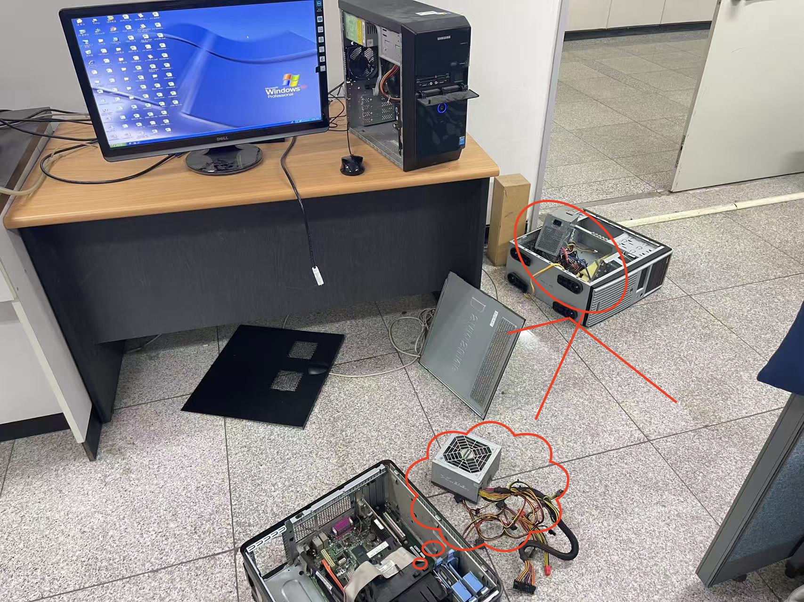

# 광산란 장비용 컴퓨터 및 Windows XP 재설치 안내

이 페이지는 광산란 장비용 컴퓨터 사용 시 발생할 수 있는 문제, 전원 교체 방법, Windows XP 재설치 관련 자료 및 주의사항을 정리한 문서입니다.

광산란 장비용 컴퓨터는 오래된 시스템이므로 임의로 조작하지 않도록 주의해야 합니다.  
문제가 발생한 경우 먼저 실험실 담당자 또는 경험이 있는 선배에게 문의하는 것이 좋습니다.

---

## 1. 광산란 장비용 컴퓨터 주의사항

광산란 장비용 컴퓨터는 장비 제어 및 데이터 저장에 사용되는 전용 컴퓨터입니다.  
일반적인 개인용 컴퓨터처럼 사용하면 안 됩니다.

주의사항은 아래와 같습니다.

- 인터넷에 연결하지 않습니다.
- 불필요한 프로그램을 설치하지 않습니다.
- 장비 측정 목적 외에는 사용하지 않습니다.
- 원본 데이터 파일을 직접 수정하지 않습니다.
- 여러 창을 동시에 많이 열지 않습니다.
- 컴퓨터가 느리거나 멈춘 경우 임의로 반복 조작하지 않습니다.

---

## 2. 컴퓨터 전원 문제 발생 시

광산란 장비용 컴퓨터의 본체 전원에 문제가 발생하는 경우가 있습니다.  
컴퓨터가 켜지지 않거나 전원이 불안정한 경우, 본체 전원 공급 장치를 확인해야 합니다.

아래 사진을 참고하여 전원 박스를 교체할 수 있습니다.

### 확인할 내용

- 컴퓨터 전원이 정상적으로 들어오는지 확인
- 전원 케이블이 제대로 연결되어 있는지 확인
- 전원 박스에 이상이 없는지 확인
- 필요 시 동일한 규격의 전원 장치로 교체

!!! danger "주의"
    전원 장치는 임의로 분해하거나 무리하게 조작하지 않습니다.  
    교체가 필요한 경우 담당자에게 먼저 확인한 후 진행합니다.

---

## 3. Windows XP 재설치가 필요한 경우

광산란 장비용 컴퓨터가 정상적으로 작동하지 않거나 시스템 문제가 발생한 경우, Windows XP 시스템을 다시 설치해야 할 수 있습니다.

실험실에는 Windows XP 설치와 관련된 압축 파일이 보관되어 있습니다.

[Windows XP 설치 관련 파일 다운로드](../assets/images/window/windows_xp.zip)

---

## 4. Windows XP 재설치 전 확인사항

재설치를 진행하기 전 아래 내용을 먼저 확인합니다.

- 기존 데이터 백업 여부
- 광산란 장비 프로그램 설치 파일 보관 여부
- 장비 연결 설정 정보
- Temp 프로그램 정상 작동 여부
- Excel 저장 설정
- 기존 측정 데이터 백업 여부

!!! danger "중요"
    시스템을 재설치하면 기존 설정이나 데이터가 사라질 수 있습니다.  
    재설치 전에는 반드시 필요한 파일을 백업해야 합니다.

---

## 5. 재설치 후 확인사항

Windows XP를 재설치한 후에는 아래 항목을 확인합니다.

- 컴퓨터가 정상적으로 부팅되는지 확인
- 광산란 장비 프로그램이 실행되는지 확인
- 온도 신호가 정상적으로 들어오는지 확인
- Excel 데이터 저장이 가능한지 확인
- 장비와 컴퓨터 연결 상태 확인
- 기존 측정 방식과 동일하게 작동하는지 확인

---

