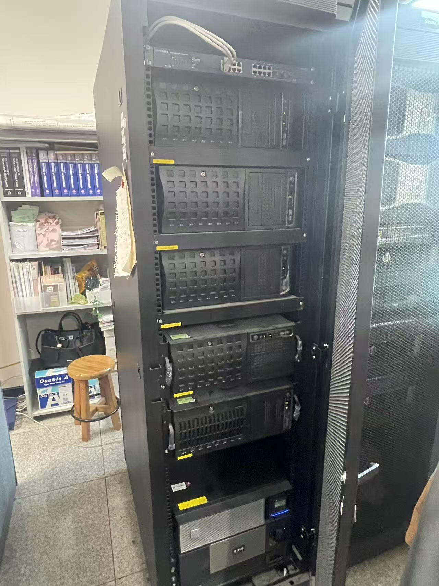
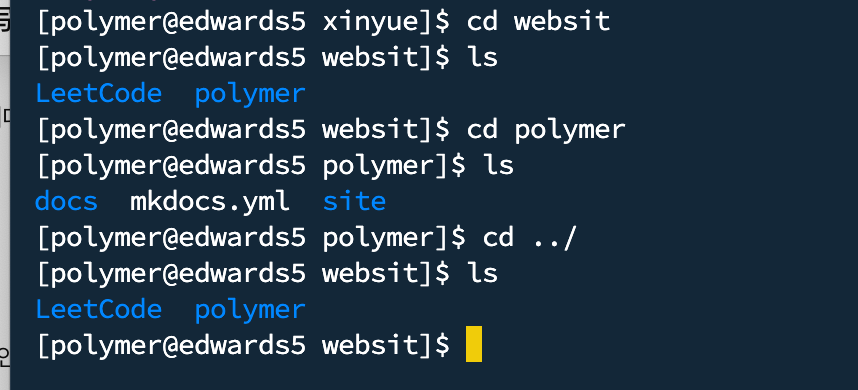

# 원격 서버 사용 안내

이 페이지는 실험실 원격 서버 접속 방법, 기본 명령어, 파일 업로드 및 다운로드 방법, 서버 사용 시 주의사항을 정리한 문서입니다.

---

## 1. 원격 서버란?

원격 서버는 계산 작업, 데이터 저장, 시뮬레이션 실행 등을 위해 사용하는 실험실 공용 컴퓨터입니다.  
개인 컴퓨터보다 장시간 계산 작업을 수행하기에 적합합니다.

---

## 2. 접속 프로그램 및 설치 파일

서버 접속과 파일 전송에는 아래 프로그램을 사용할 수 있습니다.

- PuTTY
- FileZilla
- Termius
- VS Code Remote SSH
- Terminal

PuTTY와 FileZilla 설치 파일은 아래 압축 파일을 참고합니다.

[PuTTY 및 FileZilla 설치 파일 다운로드](../assets/pdf/server/software.zip)

!!! warning "주의"
    설치 파일의 용량이 100MB를 넘으면 GitHub에 업로드할 수 없습니다.  
    용량이 큰 경우에는 Google Drive, OneDrive 또는 실험실 서버에 따로 보관하고 링크만 남기는 것이 좋습니다.

---

## 3. 서버 접속 방법

서버 접속 시 필요한 정보는 아래와 같습니다.

| 항목 | 내용 |
|---|---|
| 서버 주소 | 담당자에게 확인 |
| 사용자 이름 | 개인 계정 |
| 비밀번호 | 개인 계정 비밀번호 |
| 접속 프로그램 | PuTTY, Termius, VS Code Remote SSH 등 |

!!! danger "보안 주의"
    서버 IP, 사용자 이름, 비밀번호는 외부에 공개하지 않습니다.  
    GitHub Pages는 공개 웹사이트이므로 실제 계정 정보나 비밀번호를 문서에 직접 작성하지 않습니다.

---

## 4. 실험실 서버 목록

현재 실험실에서 사용하는 주요 서버는 아래와 같습니다.

| 서버명 | 설명 |
|---|---|
| ed1 | 계산 서버 |
| ed2 | 계산 서버 |
| ed3 | 계산 서버 |
| ed4 | 계산 서버 |
| ed5 | 계산 서버 |
| sanchez | 메인 서버 |
| baxter | 계산 서버 |

`sanchez`는 메인 서버이며, 내부에 `sanchez1`, `sanchez2` 두 개의 하위 서버가 있습니다.

`sanchez`에 접속한 후 아래 명령어를 입력하면 하위 서버로 접속할 수 있습니다.

```bash
rsh sanchez1
```

또는:

```bash
rsh sanchez2
```

서버 IP는 아래 형식을 따릅니다.

```text
220.149.233.xxx
```

마지막 숫자는 서버마다 다르므로, 실제 접속 주소는 교수님 또는 서버 담당자에게 확인해야 합니다.

아래 이미지는 서버 접속 정보 및 서버 목록을 확인하기 위한 참고 자료입니다.



---

## 5. 파일 전송 방법

파일 전송은 주로 아래 방법을 사용할 수 있습니다.

- FileZilla
- Termius
- VS Code Remote SSH
- scp 명령어
- sftp

처음 사용하는 경우에는 FileZilla 또는 Termius를 사용하는 것이 비교적 편리합니다.

### 5.1 FileZilla 사용

FileZilla는 서버와 개인 컴퓨터 사이에 파일을 주고받을 때 사용합니다.

확인할 내용:

- 서버 주소
- 사용자 이름
- 비밀번호
- 포트 번호
- 업로드 / 다운로드 위치

### 5.2 Termius 사용

Termius는 서버 접속과 파일 전송을 함께 할 수 있는 프로그램입니다.  
외부에서 서버 상태를 확인하거나 간단한 파일 전송을 할 때 사용할 수 있습니다.

---

## 6. 기본 명령어

서버에서 자주 사용하는 기본 명령어는 아래와 같습니다.

```bash
pwd                 # 현재 위치 확인
ls                  # 파일 목록 확인
ls -lh              # 파일 크기를 보기 쉽게 표시
cd 폴더명            # 폴더 이동
cd ..               # 상위 폴더로 이동
mkdir 폴더명         # 새 폴더 만들기
rm 파일명            # 파일 삭제
rm -r 폴더명         # 폴더 삭제
cp 원본 대상         # 파일 복사
mv 원본 대상         # 파일 이동 또는 이름 변경
whoami              # 현재 사용자 이름 확인
logout              # 로그아웃
exit                # 로그아웃 또는 터미널 종료
```


---

## 7. 작업 실행 관련 명령어

계산 작업을 실행하거나 중단할 때 자주 사용하는 명령어는 아래와 같습니다.

```bash
./run.sh            # 실행 파일 실행
Ctrl + C            # 현재 실행 중인 작업 중단
Ctrl + Z            # 현재 작업 일시정지
bg                  # 일시정지한 작업을 백그라운드로 실행
q                   # 일부 프로그램 또는 top 화면 종료
```

심볼릭 링크가 필요한 경우 아래와 같은 형식으로 사용할 수 있습니다.

```bash
ln -s /home/USERNAME/ /mnt/USERNAME
```

여기서 `USERNAME`은 본인의 서버 계정 이름으로 바꿔야 합니다.

---

## 8. `top` 명령어 사용 방법

`top` 명령어는 서버에서 현재 실행 중인 프로세스와 CPU, 메모리 사용량을 실시간으로 확인할 때 사용합니다.  
서버가 느리거나 계산 작업이 제대로 실행되고 있는지 확인할 때 자주 사용합니다.

```bash
top
```

아래 이미지는 명령어 사용 예시입니다.



---

### 8.1 `top` 화면에서 확인할 수 있는 항목

| 항목 | 의미 |
|---|---|
| PID | 프로세스 ID |
| USER | 해당 작업을 실행한 사용자 |
| PR / NI | 프로세스 우선순위 |
| VIRT | 프로세스가 사용하는 전체 가상 메모리 |
| RES | 실제 물리 메모리 사용량 |
| SHR | 공유 메모리 사용량 |
| S | 프로세스 상태 |
| %CPU | CPU 사용률 |
| %MEM | 메모리 사용률 |
| TIME+ | 해당 프로세스가 사용한 누적 CPU 시간 |
| COMMAND | 실행 중인 명령어 또는 프로그램 이름 |

---

### 8.2 프로세스 상태 `S`의 의미

| 상태 | 의미 |
|---|---|
| R | 실행 중 또는 실행 대기 상태 |
| S | 대기 상태 |
| D | 디스크 입출력 등으로 인해 중단할 수 없는 대기 상태 |
| T | 정지된 상태 |
| Z | 좀비 프로세스 |

---

### 8.3 `top` 화면에서 자주 사용하는 키

| 키 | 기능 |
|---|---|
| `q` | top 종료 |
| `P` | CPU 사용률 기준으로 정렬 |
| `M` | 메모리 사용률 기준으로 정렬 |
| `u` | 특정 사용자 프로세스만 보기 |
| `1` | CPU 코어별 사용량 표시 |
| `h` | 도움말 보기 |
| `k` | 특정 프로세스 종료 |

!!! danger "주의"
    `k` 키를 사용하면 프로세스를 종료할 수 있습니다.  
    본인이 실행한 작업이 아닌 경우 절대 함부로 종료하지 않습니다.  
    다른 사람의 계산 작업을 종료하면 데이터 손실이나 계산 실패가 발생할 수 있습니다.

---

## 9. 서버 사용 시 주의사항

서버는 여러 사람이 함께 사용하는 공용 자원이므로 아래 사항을 지켜야 합니다.

- 다른 사람의 폴더나 파일을 임의로 삭제하지 않습니다.
- 큰 파일은 정리하거나 개인 저장 공간으로 이동합니다.
- 계산 작업을 실행하기 전에 저장 위치와 파일명을 확인합니다.
- 문제가 발생하면 임의로 설정을 바꾸지 말고 담당자에게 문의합니다.

---

## 10. 참고사항

 파일 정리, 작업 실행, 데이터 저장 위치를 항상 신중하게 확인해야 합니다.

서버가 느리거나 문제가 있어 보일 때 바로 재부팅하거나 프로세스를 종료하지 말고, 먼저 `top` 명령어로 어떤 작업이 CPU와 메모리를 많이 사용하고 있는지 확인합니다.  
다른 사람의 작업일 수 있으므로, 문제가 있어 보이면 해당 사용자나 서버 담당자에게 먼저 확인하는 것이 좋습니다.